# monozen-skills

**Centralized agent skill registry + workspace sandbox definition for the Monozen system.**

Agent skills are the domain expertise modules that agent CLIs (Claude Code, Cursor, CodeBuff, Crush/kilo, Gemini) use to understand your project, run commands correctly, and respect your engineering preferences. This repo is the canonical source — publish once, `npx skills add` everywhere.

```
github.com/8-BitRhyon/monozen-skills
```

---

## What This Repo Does

| Concern | What it provides |
|---|---|
| **Skill definitions** | ~42 canonical `.md` skill files organized by domain |
| **Sandbox template** | The shell + config + federation pattern you need for any new project |
| **Installation protocol** | `npx skills add` compatible — point any CLI at this repo |
| **Cross-CLI portability** | One `AGENTS.md` fragment that works across 5+ agent CLIs |

---

## The 5-Layer Sandbox

This is the architecture `monozen-skills` formalizes. Every new project inherits this stack.



### Layer 0 — Shell Substrate (`herdr`)

[**herdr**](https://herdr.app) v0.7.1 is the terminal workspace manager that runs the actual environment — it manages panes, tabs, sessions, and workspaces, and is the shell entrypoint that agent CLIs connect to. Not a `.zshrc` function, but a full daemon with a socket API:

```
~/.config/herdr/
├── config.toml         # Theme (gruvbox), agent pane layout, toast delivery
└── session.json        # Persistent session: tabs, pane splits, cwds
```

`herdr` replaces the traditional `.zshrc` `workon()` pattern — it persists the workspace state (which panes are open, what directories they're in, the split layout) across sessions. The current persistent workspace is **CS-Portfolio**, rooted at `Projects/Portfolio` with a 4-pane horizontal/vertical split layout on the **"CommandCode"** tab.

### Layer 1 — Directory Shortcut (`workon`)

A lightweight `~/.zshrc` helper that wraps `herdr`'s workspace concept for quick project changes:

```bash
workon() {
    local folder_name="$1"
    local target_path="/Users/rhyon/Downloads/Self Curated CS Curriculum/Projects/$folder_name"
    if [ -d "$target_path" ]; then
        cd "$target_path"
        echo "🚀 Switched path context to: $(pwd)"
    fi
}
```

**Pattern:** `workon {project}` → `cd Projects/{project}`. This is purely a `cd` shortcut; `herdr` handles the actual workspace and session management.

### Layer 2 — Configuration & Permission Gate (`kilo.jsonc`)

`~/.config/kilo/kilo.jsonc` is the central configuration that controls:

- **Permissions** — `permission.bash = "allow"` grants full shell access
- **Skills federation** — `skills.paths` lists the 6 directories that skill files live in
- **Agent role delegation** — orchestrator, code, debug, ask, plan, code-reviewer each map to specific provider + model combinations
- **Indexing pipeline** — OpenRouter + free embedding model for semantic search

```jsonc
// ~/.config/kilo/kilo.jsonc (simplified)
{
  "permission": { "bash": "allow" },
  "skills": {
    "paths": [
      "~/.agents/skills",
      "~/.commandcode/skills",
      "~/.gemini/config/skills",
      "~/.gemini/config/plugins/modern-web-guidance-plugin/skills",
      "~/.gemini/config/plugins/ui-ux-pro-max-skill/.claude/skills"
    ]
  },
  "agent": {
    "orchestrator": { "model": "agentrouter/gpt-5.5" },
    "code": { "model": "zenmux/deepseek/deepseek-v4-flash" },
    "plan": { "model": "zenmux/deepseek/deepseek-v4-pro" }
  }
}
```

### Layer 3 — Skills Federation

Skills are **federated** — they live across the filesystem in CLI-specific directories but share a common namespace. The federation encompasses **42 unique skills across 6 directories**:


| Directory | Skills | Source |
|---|---|---|
| `.agents/skills/` | 28 | Community + custom skills |
| `.commandcode/skills/` | 4 | Monozen core (architecture, nav, themes, webgl) |
| `.gemini/config/skills/` | 11 | Gemini-native design skills |
| `.gemini/config/plugins/modern-web-guidance/skills/` | 2 | Modern web plugin |
| `.gemini/config/plugins/ui-ux-pro-max/.claude/skills/` | 7 | UI/UX pro max plugin |
| `command-code/skills/` (npm global) | 2 | Shipped with command-code package |

### Layer 4 — Distribution (`npx skills add`)

`npx skills add github.com/8-BitRhyon/monozen-skills` installs skill files to the federation. The repo is structured so the install script can map each canonical skill to its target directory.

```
CLI (npx skills add)
  → fetches repo
  → reads skills/index.json
  → distributes files to each federated path
  → validates integrity
```

---

## Proposed Directory Tree

```
monozen-skills/
│
├── README.md                        # ← you are here
├── FEDERATION.md                    # Federation map + protocol
├── CHANGELOG.md                     # Version history
├── LICENSE                          # MIT
├── package.json                     # npm package for npx skills add
│
├── skills/                          # ★ CANONICAL SKILL DEFINITIONS
│   ├── index.json                   # Machine-readable registry
│   │
│   ├── monozen/                     # Monozen portfolio skills
│   │   ├── architecture.md
│   │   ├── nav.md
│   │   ├── themes.md
│   │   └── webgl.md
│   │
│   ├── gsap/                        # GSAP animation skills
│   │   ├── core.md
│   │   ├── frameworks.md
│   │   ├── performance.md
│   │   ├── plugins.md
│   │   ├── react.md
│   │   ├── scrolltrigger.md
│   │   ├── timeline.md
│   │   └── utils.md
│   │
│   ├── diagramming/                 # Diagram generation skills
│   │   ├── mermaid.md
│   │   ├── plantuml.md
│   │   ├── drawio.md
│   │   ├── excalidraw.md
│   │   └── tldraw.md
│   │
│   ├── research/                    # Academic research skills
│   │   ├── paper-fetch.md
│   │   ├── semantic-scholar.md
│   │   ├── asta.md
│   │   └── journal-abbrev.md
│   │
│   ├── media/                       # Media production skills
│   │   ├── bangumi-frames.md
│   │   └── video-podcast-maker.md
│   │
│   ├── pi/                          # Pi-companion runtime skills
│   │   ├── cli-runtime.md
│   │   ├── prompting.md
│   │   └── result-handling.md
│   │
│   ├── tooling/                     # Tool & automation skills
│   │   ├── improve.md
│   │   ├── agent-browser.md
│   │   └── target-prioritization.md
│   │
│   └── design/                      # Design skills
│       ├── design.md
│       ├── banner-design.md
│       ├── brand.md
│       ├── design-system.md
│       ├── slides.md
│       ├── ui-styling.md
│       ├── ui-ux-pro-max.md
│       ├── chrome-extensions.md
│       ├── modern-web-guidance.md
│       ├── claude-mem.md
│       ├── ponytail.md
│       ├── superpowers.md
│       └── make-interfaces-feel-better.md
│
├── assets/                          # Visual assets
│   ├── monozen-skills-arch.svg      # Architecture diagram
│   └── monozen-skills-federation.svg # Federation mindmap
│
├── templates/                       # Scaffolding for new projects
│   ├── AGENTS.md                    # Seed AGENTS.md (cross-CLI)
│   ├── taste.md                     # Seed taste preferences
│   ├── kilo.jsonc                   # Project-local sandbox override
│   └── workon-integration.md        # How to wire workon() for this project
│
├── env/                             # Sandbox documentation
│   ├── shell.md                     # workon() pattern, PATH conventions
│   ├── kiloconfig.md                # Provider routing, permissions, indexing
│   └── federation.md                # Skills directory map, load order
│
├── docs/                            # Reference documentation
│   ├── scaling.md                   # How to add new skills
│   ├── workflow-conventions.md      # Agent workflow rules
│   └── taste-system.md              # How taste is harvested & published
│
└── scripts/                         # Utility scripts
    ├── install.sh                   # npx skills add entry point
    ├── validate.sh                  # Check skill integrity
    └── manifest.sh                  # Generate index.json from directory
```

---

## Getting Started

### For a new project

```bash
# 1. Create your project
workon new-project

# 2. Copy the templates
cp monozen-skills/templates/AGENTS.md ./
cp monozen-skills/templates/kilo.jsonc ~/.config/kilo/kilo.jsonc

# 3. Install skills
npx skills add github.com/8-BitRhyon/monozen-skills

# 4. Your CLI picks up AGENTS.md → reads federation → skills are live
```

### For an existing project

```bash
# 1. Add AGENTS.md reference
cat monozen-skills/templates/AGENTS.md >> AGENTS.md

# 2. Refresh skills
npx skills add github.com/8-BitRhyon/monozen-skills
```

---

## Skill File Format

Each skill is a Markdown file with YAML frontmatter:

```markdown
---
id: gsap-core
title: GSAP Core Animation
domain: gsap
version: 1.0.0
tags: [animation, gsap, javascript, dom]
consumers: [claude-code, cursor, codebuff, crush]
---

# GSAP Core

...
```

The `consumers` field determines which federated path the skill gets installed to. `index.json` is the authoritative registry generated from these fields.

---

## Configuration Reference

| File | Path | Purpose |
|---|---|---|
| `config.toml` | `~/.config/herdr/config.toml` | herdr workspace manager: theme, agent pane layout, toast delivery |
| `kilo.jsonc` | `~/.config/kilo/kilo.jsonc` | Central sandbox config: permissions, skills paths, agent delegation, indexing |
| `AGENTS.md` | `<project-root>/AGENTS.md` | Cross-CLI agent instructions (read by all 5+ CLIs) |
| `taste.md` | `<project-root>/.commandcode/taste/taste.md` | Continuously-learned preferences for Command Code |

---

## Agent Role Delegation

Your `kilo.jsonc` delegates specific agent roles to different provider/model combinations:

| Role | Provider | Model | Purpose |
|---|---|---|---|
| **orchestrator** | agentrouter | gpt-5.5 | High-level planning & coordination |
| **code** | zenmux (deepseek) | deepseek-v4-flash | Hands-on code generation |
| **debug** | agentrouter | glm-5.2 | Debugging & diagnostics |
| **ask** | agentrouter | gpt-5.5 | Research & Q&A |
| **plan** | zenmux (deepseek) | deepseek-v4-pro | Architecture & planning |
| **code-reviewer** | opencode | north-mini-code-free | Lightweight review |
| **web-perf-auditor** | opencode | deepseek-v4-flash-free | Web performance checks |

This role delegation pattern is what makes the sandbox **portable** — any new project wired with the same `kilo.jsonc` gets the same capability routing without manual config.

---

## Scaling to Future Projects

When you add a new project at `Projects/CoolThing`:

1. `workon CoolThing` — shell resolves the path
2. `cp templates/AGENTS.md .` — project gets its own agent instructions
3. `cp templates/kilo.jsonc ~/.config/kilo/kilo.jsonc` — or merge into existing config
4. `npx skills add` — skills are installed (or already present from previous install)
5. Start coding — your CLI reads AGENTS.md → skills are available

The repo's `templates/` directory is designed to be the one-stop scaffold for this exact workflow.

---

## Maintenance

### Adding a new skill

1. Create the Markdown file in the appropriate `skills/<domain>/` directory
2. Add `consumers` in frontmatter to control federation destination
3. Run `scripts/manifest.sh` to regenerate `skills/index.json`
4. Commit, push, tag
5. Users run `npx skills add` to sync

### Validating the registry

```bash
./scripts/validate.sh
```

### Publishing a release

```bash
# Bump version in package.json
# Update CHANGELOG.md
git tag v1.0.1
git push --tags
```

---

## Related

| Resource | Link |
|---|---|
| **Portfolio repo** (Monozen SPA) | `github.com/8-BitRhyon/portfolio` |
| **herdr workspace manager** | `~/.config/herdr/` — [herdr.app](https://herdr.app) |
| **AGENTS.md** (cross-CLI instructions) | Included in portfolio repo |
| **design.md** (canonical design doc) | `design.md` in portfolio root |
| **kilo.jsonc** (sandbox config) | `~/.config/kilo/kilo.jsonc` |
| **workon()** (shell shortcut) | `~/.zshrc` |

---

## License

MIT — This is an open agent skill registry. Use freely, adapt for your own workspace.
