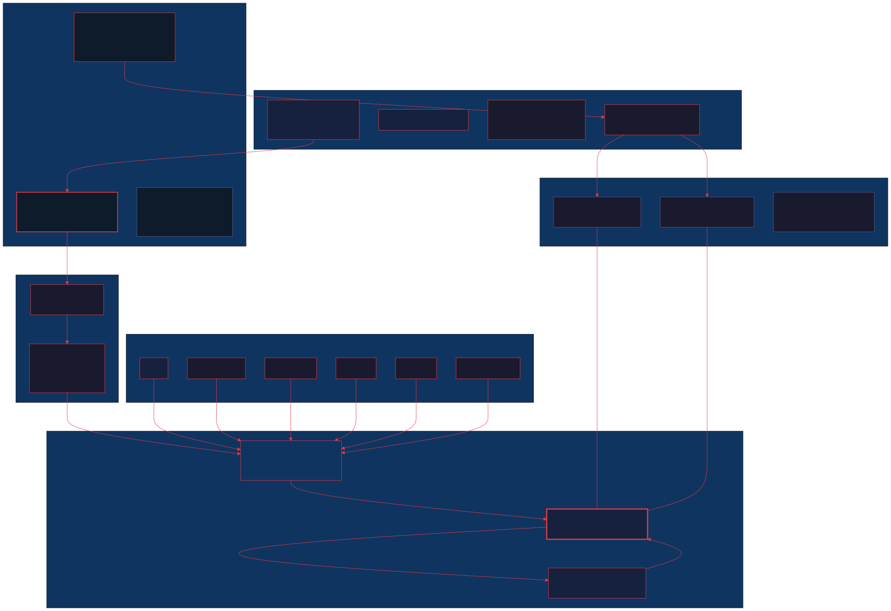
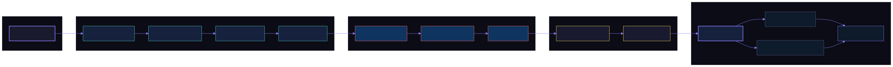

# monozen-skills

> **"What if your engineering preferences were executable code instead of tribal knowledge?"**

`monozen-skills` is the canonical registry of **executable agent skill protocols** and workstation sandbox definitions for the Monozen engineering system. Publish once, distribute to any agent CLI (`Claude Code`, `Cursor`, `CodeBuff`, `Kilo`, `Gemini`).

```bash
npx skills add github.com/8-BitRhyon/monozen-skills
```

---

## Engineering Philosophy & Core Identity

Monozen operates on **cognitive persona isolation** and **epistemic discipline**:

- **Moon (The Systemizer)**: Cold diagnostic precision, reticle HUDs, WebGL memory safety, unit test gates (`npm test`), and zero-hallucination verification.
- **Sun (The Shaper)**: Technical drafting table, crisp line geometry, real-browser DevTools validation (`chrome-devtools-axi`), and scrollytelling narratives.
- **Evidence Over Hope**: *"Seems right is not done."* Every change is governed by failing TDD prove-it cycles, build verification, and real-browser DevTools inspections.

📖 **Read the full manifesto in [PHILOSOPHY.md](PHILOSOPHY.md).**

---

## Why Executable Skills? (Before & After)

| Scenario | Agent WITHOUT `monozen-workflow` | Agent WITH `monozen-workflow` |
|---|---|---|
| **Debugging CSS Transform Bug** | Spends 45 minutes editing CSS animation keyframes on `#mz-cursor`, repeatedly pinning the reticle to `(0,0)`. | Immediately checks Pitfall #4: *"CSS transform animation overrides GSAP inline transform. Move rotation to inner `<svg>` child."* Fixes in 1 step. |
| **Theme Toggle Refactor** | Adds event listeners without cleanup, leaking rAF render loops and doubling observers on each theme switch. | Executes theme lifecycle contract: calls `__destroy()` before `__init()`, clears rAF, and disconnects observers. |
| **Verifying Runtime Fix** | Assumes the code works because `npm test` passes in Node mock environment. | Executes Chrome DevTools AXI evaluation against live DOM (`chrome-devtools-axi snapshot`) to prove browser reality. |

---

## Skill Taxonomy (14 Canonical Skills)


### Workflow — 6 skills
| Skill | Invocation | Description |
|---|---|---|
| `agentic-loop` | `/agentic-loop` | Universal observe → plan → act → verify autonomous execution cycle |
| `monozen-workflow` | `/monozen-workflow` | Portfolio TDD prove-it + DevTools verification protocol |
| `task-decomposition` | `/task-decomposition` | Breaks complex engineering requests into atomic, testable units |
| `context-engineering` | `/context-engineering` | Optimizes context window setup, token budget, and memory across sessions |
| `prompt-engineering-loop` | `/prompt-engineering-loop` | 6-step iterative prompt refinement & adversarial pressure testing |
| `skill-authoring` | `/skill-authoring` | Meta-skill for authoring clean, runnable agent skill modules |

### Audit — 3 skills
| Skill | Invocation | Description |
|---|---|---|
| `monozen-audit` | `/monozen-audit` | Multi-axis QA: WebGL memory safety, CSP sync, reduced-motion, history purge |
| `production-web-audit` | `/production-web-audit` | Universal pre-deployment security, performance, & CSP audit |
| `test-driven-dev` | `/test-driven-dev` | TDD pattern: failing test first, verify via DevTools |

### Architecture — 4 skills
| Skill | Invocation | Description |
|---|---|---|
| `monozen-architecture` | `/monozen-architecture` | 5-panel SPA architecture & theme decoupling contracts |
| `monozen-themes` | `/monozen-themes` | Sun/Moon design tokens, typography, and visual identity |
| `monozen-webgl` | `/monozen-webgl` | WebGL2 50% downsample pipeline & shader context management |
| `monozen-nav` | `/monozen-nav` | Nav capsule, corner bracket GSAP Flip, and brand crossfade |

### Tooling — 1 skill
| Skill | Invocation | Description |
|---|---|---|
| `git-workflow` | `/git-workflow` | Commit signing (SSH), history purge, pre-commit universal guard |

---

## System Architecture & Federation



Skills flow from canonical authoring in this repo through validation and signing, then are distributed to each CLI's native skill directory via `npx skills add`. No symlinks, no shared state — each consumer reads from its own path.

- 📖 **[FEDERATION.md](FEDERATION.md)**: 6-directory federation breakdown, resolution hierarchy, and consumer-to-path mapping.
- 📖 **[WORKSTATION.md](WORKSTATION.md)**: Terminal multiplexer stack (`Ghostty` → `tmux` → `herdr`).

---

## Validation Pipeline



Every skill in this repo passes through a multi-stage gate before distribution:

```bash
# Validate frontmatter, zero em-dashes, and path portability across all skills
npm run validate

# Regenerate skills-lock.json manifest
npm run manifest
```

The pre-commit hook enforces:
- No sensitive IDs (zone/account IDs, SSH fingerprints, API tokens)
- No unsigned commits (SSH signing required)
- No tracked AGENTS.md or legacy artifacts

---

## License

MIT — Authored by [8-BitRhyon](https://github.com/8-BitRhyon).
