# Monozen Workstation — Terminal Stack & Agentic Toolchain

Terminal multiplexer + theme setup: **Ghostty → tmux → herdr**.
Modeled on [omerxx/dotfiles](https://github.com/omerxx/dotfiles) but adapted for
**tmux 3.7b**, **Ghostty 1.3.1**, and **herdr** (both have breaking changes vs.
omerxx's newer setup).

"Tabs" are **tmux windows** rendered as Catppuccin pills in the status bar — not
Ghostty's native tab bar.

---

## Pipeline Architecture

```mermaid
flowchart LR
    subgraph Terminal["Terminal Layer"]
        G[Ghostty]
    end

    subgraph Multiplexer["Multiplexer Layer"]
        T[tmux + catppuccin pills]
        H[herdr agent multiplexer]
    end

    subgraph Agents["Agent Layer"]
        KC[Kilo / Claude Code]
        LG[lazygit]
        NV[nvim]
    end

    subgraph Toolchain["Zsh Toolchain"]
        FZ[fzf fuzzy finder]
        ZD[zoxide cd]
        EZ[eza ls]
        BT[bat cat]
        RG[ripgrep]
        FD[fd find]
        DL[delta diff]
        ZA[zsh-autosuggestions]
        ZH[zsh-syntax-highlighting]
    end

    subgraph VersionControl["Git Layer"]
        GH[GitHub]
        MS[monozen-skills]
        PF[Portfolio]
    end

    G -->|runs| T
    T -->|contains| H
    H -->|manages| KC
    KC -->|uses| Toolchain
    KC -->|git via| LG
    KC -->|edits via| NV
    LG -->|pushes to| VersionControl
    NV -.->|also launches| LG

    style G fill:#1e1e2e,stroke:#89b4fa
    style T fill:#1e1e2e,stroke:#a6e3a1
    style H fill:#1e1e2e,stroke:#f5c2e7
    style KC fill:#1e1e2e,stroke:#fab387
    style Toolchain fill:#181825,stroke:#cdd6f4
    style VersionControl fill:#181825,stroke:#89b4fa
```



### Physical screen layout

Herdr's agent panel occupies the **top** line. tmux's Catppuccin pill status bar
sits at the **bottom**. This gives:

```
┌─ herdr agent tab bar ──────────────────────────────────────┐
│                                                             │
│  [agent panes — Kilo, Claude Code, etc.]                   │
│                                                             │
├─ tmux Catppuccin pills (bottom) ───────────────────────────┤
│    #W  █  #N      session     ~/dir             │
└─────────────────────────────────────────────────────────────┘
```

---

## Components

| Layer | Component | Purpose |
|-------|-----------|---------|
| Terminal | **Ghostty** | GPU-accelerated terminal (transparent, non-native fullscreen) |
| Multiplexer | **tmux** | Window/pane manager with Catppuccin pill status bar |
| Multiplexer | **herdr** | AI agent workspace multiplexer |
| Package | **Homebrew** | macOS package manager |
| Editor | **nvim** | Code editor (Lazy.nvim + Catppuccin + Telescope + LSP) |
| Git GUI | **lazygit** | Terminal git UI |
| Navigation | **zoxide** | Smarter `cd` (learns your paths, `z <fragment>` to jump) |
| Navigation | **fzf** | Fuzzy finder (files, history, processes, git) |
| Search | **ripgrep (rg)** | Blazing-fast code search |
| Search | **fd** | Blazing-fast file finding |
| List | **eza** | Modern `ls` with icons, tree view, colors |
| View | **bat** | Modern `cat` with syntax highlighting + git gutter |
| Diff | **delta** | Syntax-highlighted git diff pager |
| Shell | **zsh-autosuggestions** | Fish-like autosuggestions from history |
| Shell | **zsh-syntax-highlighting** | Real-time command syntax coloring |
| Line | **AeroSpace** | Tiling window manager (fullscreen alternative) |

---

## Files

| File | Purpose |
|------|---------|
| `~/.config/ghostty/config` | Ghostty: blur, fullscreen, no `command` |
| `~/.tmux.conf` | tmux: catppuccin pills (omerxx fork), prefix `^A`, vim nav |
| `~/.zshrc` | Shell init: toolchain aliases, fzf, zoxide, tmux auto-start |
| `~/.gitconfig` | Git: delta pager, nvim editor, zdiff3 merge |
| `~/.gitignore_global` | Global gitignore (macOS, editor, build artifacts) |
| `~/.config/lazygit/config.yml` | LazyGit: dark theme, delta pager, nvim as editor |
| `~/.config/nvim/init.lua` | Neovim: Lazy.nvim, Catppuccin, Telescope, LSP |
| `~/.config/aerospace/aerospace.toml` | AeroSpace: tiling WM config, fullscreen bind |
| `~/.secrets.zsh` | API keys, `chmod 600`, sourced by `.zshrc` |
| `dotfiles/` (this repo) | Reference copies of all config files |

### Plugin directory

```
~/.tmux/plugins/
├── tpm                    # Plugin manager
├── catppuccin-tmux        # omerxx/catppuccin-tmux fork
├── tmux-resurrect         # Session save/restore
├── tmux-continuum         # Auto-save every 15min, auto-restore
├── tmux-sensible          # Sensible defaults
├── tmux-yank              # System clipboard
└── tmux-sessionx          # omerxx/tmux-sessionx fork (fzf picker)
```

### Herdr plugins

| Plugin | Purpose |
|--------|---------|
| **Tab Auto-Rename** | Auto-rename tabs to focused pane's directory |
| **Herdr Plus** | Project templates, quick actions launcher |
| **Spreader** | tmuxinator-style YAML layout apply |
| **reviewr** | Native terminal code-review sidebar |
| **llmtrim** | ⚠️ LLM token proxy — transparent MITM that intercepts all API calls from agent panes. See gotcha #9. |
| **GitHub Start** | Open a herdr tab from a GitHub issue/PR |
| **File Viewer** | Git-aware read-only file tree in a split pane |
| **Vim Navigation** | Seamless Ctrl+h/j/k/l across herdr panes + nvim |

---

## Key gotchas (the hard-won part)

### 1. Use `omerxx/catppuccin-tmux` fork, not upstream
The upstream `catppuccin/tmux` has different fill/color handling that results in
a blacked-out tab bar background. omerxx's fork (which he uses himself) renders
correctly. The fork also avoids the `current_file` format variable bug on tmux
3.7b entirely — no manual patching needed.

### 2. Tmux plugins need explicit `run` lines (TPM auto-loader is unreliable on 3.7b)
catppuccin, sensible, yank, resurrect, continuum, and sessionx are all loaded
via explicit `run` lines, not just TPM `@plugin` declarations. If you re-clone
plugins and forget the `run` lines, they silently won't load.

### 4. tmux status bar at bottom (herdr panel at top)
Herdr's agent panel occupies the top line. With `status-position top`, the
Catppuccin pills collide with herdr's UI. Setting `status-position bottom`
separates them cleanly.

### 5. Ghostty `command` is wrapped through a login shell
`/usr/bin/login … bash -c "exec -l …"` mangles shell operators (`||`) into a
malformed single command → "failed to launch the requested command." Do **not**
launch tmux via Ghostty `command`. Auto-start from `~/.zshrc`:
```sh
if [[ -o interactive ]] && [[ -z "$TMUX" ]]; then
  /opt/homebrew/bin/tmux attach -t main || /opt/homebrew/bin/tmux new -s main
fi
```
(Absolute path — GUI-launched Ghostty has no Homebrew in `PATH`)

### 6. Fullscreen transparency
`background-blur = "macos-glass-regular"` (Apple vibrancy) renders **opaque**
in fullscreen. Use:
- `background-blur-radius = 20`
- `background-opacity = 0.85`
- `window-decoration = false`
- `macos-non-native-fullscreen = true`

Boot with `fullscreen = "non-native"` (**NOT** `"true"` = native, kills
transparency). omerxx achieves the same via **AeroSpace** fullscreen.

### 7. fzf is required by `tmux-sessionx`
Install: `brew install fzf`. Session picker at `Ctrl-A o`.

### 8. AeroSpace fullscreen replaces Ghostty fullscreen
omerxx uses AeroSpace for fullscreen (keeps transparency alive via tiling, not
native macOS fullscreen). Install:
```sh
brew install --cask nikitabobko/aerospace/aerospace
```
Config: `~/.config/aerospace/aerospace.toml`. Key: `alt-ctrl-shift-f`.

### 9. API keys
Keep out of `~/.zshrc`. Store in `~/.secrets.zsh` (`chmod 600`), sourced by
`.zshrc`. Rotate any key that was ever in plaintext. Global `.gitignore` also
excludes `.secrets.zsh` as belt-and-suspenders.

### 10. ⚠️ llmtrim is a local MITM proxy
The `llmtrim` herdr plugin sits between LLM agent panes and their API providers,
intercepting every API call to compress tokens. It runs locally and never phones
home, but understand what it does before enabling: it sees every API key and
prompt sent through any agent pane. Only install if you trust the plugin source
and want the token compression.

### 11. GPG commit signing (recommended)
Set up GPG-signed commits for verifiable authorship:
```sh
brew install gnupg
gpg --quick-generate-key "Your Name <email>" rsa3072 sign 0
gpg --list-secret-keys --keyid-format=long   # copy the key ID
git config user.signingkey <key-id>
git config commit.gpgsign true
git config tag.gpgsign true
```
Then register the public key on GitHub: Settings → SSH and GPG keys → New GPG key.
```sh
gpg --armor --export <key-id> | pbcopy
```

---

---

## Toolchain setup (fresh machine)

```sh
# Terminal + multiplexer
brew install --cask ghostty
brew install tmux

# Plugin manager + omerxx forks
git clone https://github.com/tmux-plugins/tpm ~/.tmux/plugins/tpm
git clone https://github.com/omerxx/catppuccin-tmux ~/.tmux/plugins/catppuccin-tmux
git clone https://github.com/omerxx/tmux-sessionx ~/.tmux/plugins/tmux-sessionx
git clone https://github.com/tmux-plugins/tmux-resurrect ~/.tmux/plugins/tmux-resurrect
git clone https://github.com/tmux-plugins/tmux-continuum ~/.tmux/plugins/tmux-continuum
git clone https://github.com/tmux-plugins/tmux-sensible ~/.tmux/plugins/tmux-sensible
git clone https://github.com/tmux-plugins/tmux-yank ~/.tmux/plugins/tmux-yank

# CLI toolchain
brew install neovim lazygit zoxide bat eza fd ripgrep delta fzf gnupg zsh-autosuggestions zsh-syntax-highlighting
$(brew --prefix)/opt/fzf/install

# Tiling WM
brew install --cask nikitabobko/aerospace/aerospace

# Copy config files from this repo's dotfiles/
cp dotfiles/tmux.conf ~/.tmux.conf
cp dotfiles/zshrc.template ~/.zshrc   # customize paths
cp dotfiles/gitconfig ~/.gitconfig
cp dotfiles/gitignore_global ~/.gitignore_global
mkdir -p ~/.config/lazygit ~/.config/nvim
cp dotfiles/lazygit/config.yml ~/.config/lazygit/config.yml
cp dotfiles/nvim/init.lua ~/.config/nvim/init.lua
mkdir -p ~/.config/aerospace
cp dotfiles/aerospace.toml ~/.config/aerospace/aerospace.toml

# Start tmux (inside Ghostty), then install TPM plugins
tmux new -s main
# In tmux: Ctrl-A I (capital I) to install TPM plugins
```

---

## Tmux prefix / tab cheat sheet

| Key | Action |
|-----|--------|
| `Ctrl-A c` | new tab |
| `Ctrl-A H` / `Ctrl-A L` | previous / next tab |
| `Ctrl-A o` | session picker (fzf) |
| click a pill | switch tab |
| `Ctrl-A s` / `Ctrl-A v` | split hoz / vert (vim-style) |
| `Ctrl-A z` | zoom pane |
| `Ctrl-A h/j/k/l` | navigate panes |
| `Ctrl-A r` | reload `~/.tmux.conf` |
| `Ctrl-A P` | toggle pane borders |
| `Ctrl-A I` | install TPM plugins |
| `Ctrl-A x` | kill pane |

---

## Git workflow

```sh
# Browse staged/unstaged changes with delta side-by-side
git diff          # delta pager
git log --oneline # delta decorations

# Interactive git UI
lazygit

# Quick fuzzy search
rg "pattern"            # ripgrep
fd "filename"           # fd
Ctrl-T / Ctrl-R / Alt-C # fzf (file, history, cd)

# Smart navigation
z proj          # jumps to ~/.../Projects
z portf         # jumps to Portfolio
```
