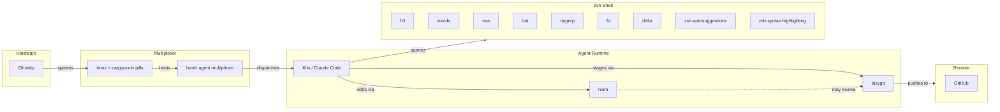

# WORKSTATION — Diagnostic

Terminal multiplexer stack: **Ghostty → tmux → herdr**.
Adapted from [omerxx/dotfiles](https://github.com/omerxx/dotfiles) for **tmux 3.7b**,
**Ghostty 1.3.1**, **herdr**.

Tabs are **tmux windows** rendered as Catppuccin pills — not Ghostty native tabs.

---

## Pipeline



### Layout

```
herdr agent tab bar — top
──────────────────────────────
[agent panes — Kilo, Claude Code]
──────────────────────────────
tmux Catppuccin pills — bottom
   #W █ #N     session     ~/dir 
```

---

## Stack

| Layer | Component | Function |
|-------|-----------|----------|
| Terminal | Ghostty | GPU-accelerated terminal, transparent, non-native fullscreen |
| Multiplexer | tmux | Window/pane manager, Catppuccin pill status bar |
| Multiplexer | herdr | AI agent workspace multiplexer |
| Editor | nvim | Code editor — Lazy.nvim, Catppuccin, Telescope, LSP |
| Git UI | lazygit | Terminal git interface |
| Directory jump | zoxide | Frequency-ranked path resolution |
| Fuzzy finder | fzf | File, history, process, git matching |
| Code search | ripgrep | Pattern search across working tree |
| File find | fd | Filesystem traversal |
| File list | eza | Directory listing with icons, tree, permissions |
| File preview | bat | Syntax highlighting, git change markers |
| Diff viewer | delta | Git diff pager, side-by-side, line numbers |
| History autosuggest | zsh-autosuggestions | History-driven inline completion |
| Syntax validation | zsh-syntax-highlighting | Token-color mapping on input |
| Tiling WM | AeroSpace | macOS tiling window manager, fullscreen binding |
| Package | Homebrew | macOS package resolution |

---

## Files

| Path | Role |
|------|------|
| `~/.config/ghostty/config` | Ghostty — blur radius, opacity, non-native fullscreen, no `command` |
| `~/.tmux.conf` | tmux — omerxx catppuccin fork, prefix `^A`, vim-style pane nav |
| `~/.zshrc` | Shell init — toolchain aliases, fzf, zoxide, tmux auto-start |
| `~/.gitconfig` | Git — delta pager, nvim editor, zdiff3 merge, gpgsign |
| `~/.gitignore_global` | Global gitignore — macOS, editor, build artifacts, secrets |
| `~/.config/lazygit/config.yml` | LazyGit — dark theme, delta pager, nvim |
| `~/.config/nvim/init.lua` | Neovim — Lazy.nvim, Catppuccin, Telescope, LSP |
| `~/.config/aerospace/aerospace.toml` | AeroSpace — tiling binds, fullscreen shortcut |
| `~/.secrets.zsh` | API keys, `chmod 600`, sourced by `.zshrc` |
| `dotfiles/` (this repo) | Reference configs |

### tmux plugins

```
~/.tmux/plugins/
├── tpm                    # Plugin lifecycle
├── catppuccin-tmux        # omerxx/catppuccin-tmux fork
├── tmux-resurrect         # Session serialization
├── tmux-continuum         # Auto-save 15min interval, auto-restore
├── tmux-sensible          # Baseline settings
├── tmux-yank              # Clipboard bridge
└── tmux-sessionx          # omerxx fork, fzf session picker
```

### herdr plugins

| Plugin | Function |
|--------|----------|
| Tab Auto-Rename | Tab label ← focused pane directory |
| Herdr Plus | Project templates, quick action launcher |
| Spreader | YAML layout application |
| reviewr | Terminal code-review sidebar |
| llmtrim | ⚠️ LLM token proxy — intercepts agent API calls. See gotcha #10. |
| GitHub Start | Tab origin from GitHub issue/PR |
| File Viewer | Git-aware read-only file tree |
| Vim Navigation | Ctrl+h/j/k/l bridging herdr panes ↔ nvim |

---

## Gotchas

### 1. Use `omerxx/catppuccin-tmux` fork, not upstream `catppuccin/tmux`
Upstream fill/color handling produces a blacked-out tab bar background. omerxx's
fork renders correctly. The fork also avoids the `current_file` format variable
bug on tmux 3.7b — no manual patching required.

### 2. Tmux plugins require explicit `run` lines on 3.7b
catppuccin, sensible, yank, resurrect, continuum, and sessionx are loaded via
`run` lines, not TPM `@plugin` declarations. TPM's auto-loader is unreliable
on 3.7b. Re-cloning plugins without the `run` lines produces silent load
failure.

### 3. tmux status bar at bottom — herdr panel at top
herdr's agent panel occupies the top line. `status-position top` causes
Catppuccin pills to collide with herdr's UI. `status-position bottom`
separates them.

### 4. Ghostty `command` is wrapped through a login shell
`/usr/bin/login … bash -c "exec -l …"` mangles shell operators (`||`) into a
malformed single command → `failed to launch the requested command`. Do not
launch tmux via Ghostty `command`. Auto-start from `~/.zshrc`:
```sh
if [[ -o interactive ]] && [[ -z "$TMUX" ]]; then
  /opt/homebrew/bin/tmux attach -t main || /opt/homebrew/bin/tmux new -s main
fi
```
(Absolute path required — GUI-launched Ghostty does not resolve Homebrew PATH.)

### 5. Fullscreen transparency
`background-blur = "macos-glass-regular"` renders opaque in fullscreen.
Required settings:
- `background-blur-radius = 20`
- `background-opacity = 0.85`
- `window-decoration = false`
- `macos-non-native-fullscreen = true`

Boot with `fullscreen = "non-native"`. `fullscreen = "true"` enables native
fullscreen, which kills transparency.

### 6. fzf required by `tmux-sessionx`
Install: `brew install fzf`. Session picker: `Ctrl-A o`.

### 7. AeroSpace fullscreen replaces Ghostty fullscreen
AeroSpace fullscreen preserves terminal transparency (tiling-based, not native
macOS fullscreen). Install:
```sh
brew install --cask nikitabobko/aerospace/aerospace
```
Config: `~/.config/aerospace/aerospace.toml`. Trigger: `alt-ctrl-shift-f`.

### 8. API keys
Keys stored in `~/.secrets.zsh` (`chmod 600`), sourced by `.zshrc`. Never
written to `.zshrc`. Global `.gitignore` excludes `.secrets.zsh` as
belt-and-suspenders. Rotate any key that was ever in plaintext.

### 9. GPG commit signing
Signed commits verify authorship. Procedure:
```sh
brew install gnupg
gpg --quick-generate-key "Your Name <email>" rsa3072 sign 0
gpg --list-secret-keys --keyid-format=long
git config user.signingkey <key-id>
git config commit.gpgsign true
git config tag.gpgsign true
```
Register public key on GitHub → Settings → SSH and GPG keys → New GPG key.
```sh
gpg --armor --export <key-id> | pbcopy
```

### 10. ⚠️ llmtrim — local MITM proxy
The llmtrim plugin intercepts all LLM API calls from agent panes to compress
token usage. It runs locally, never phones home, but it sees every API key and
prompt passing through herdr agent panes. Understand the interception surface
before enabling.

---

## Fresh machine install

```sh
# Terminal + multiplexer
brew install --cask ghostty
brew install tmux

# tmux plugins
git clone https://github.com/tmux-plugins/tpm ~/.tmux/plugins/tpm
git clone https://github.com/omerxx/catppuccin-tmux ~/.tmux/plugins/catppuccin-tmux
git clone https://github.com/omerxx/tmux-sessionx ~/.tmux/plugins/tmux-sessionx
git clone https://github.com/tmux-plugins/tmux-resurrect ~/.tmux/plugins/tmux-resurrect
git clone https://github.com/tmux-plugins/tmux-continuum ~/.tmux/plugins/tmux-continuum
git clone https://github.com/tmux-plugins/tmux-sensible ~/.tmux/plugins/tmux-sensible
git clone https://github.com/tmux-plugins/tmux-yank ~/.tmux/plugins/tmux-yank

# CLI toolchain
brew install neovim lazygit zoxide bat eza fd ripgrep delta fzf gnupg zsh-autosuggestions zsh-syntax-highlighting
$(brew --prefix)/opt/fzf/install

# Tiling WM
brew install --cask nikitabobko/aerospace/aerospace

# Deploy configs from this repo's dotfiles/
cp dotfiles/tmux.conf ~/.tmux.conf
cp dotfiles/zshrc.template ~/.zshrc
cp dotfiles/gitconfig ~/.gitconfig
cp dotfiles/gitignore_global ~/.gitignore_global
mkdir -p ~/.config/lazygit ~/.config/nvim
cp dotfiles/lazygit/config.yml ~/.config/lazygit/config.yml
cp dotfiles/nvim/init.lua ~/.config/nvim/init.lua
mkdir -p ~/.config/aerospace
cp dotfiles/aerospace.toml ~/.config/aerospace/aerospace.toml

# Initialize tmux, install plugins via TPM
tmux new -s main
# Ctrl-A I to install
```

---

## Prefix reference

| Sequence | Action |
|----------|--------|
| `Ctrl-A c` | new tab |
| `Ctrl-A H` / `Ctrl-A L` | previous / next tab |
| `Ctrl-A o` | session picker (fzf) |
| click pill | switch tab |
| `Ctrl-A s` / `Ctrl-A v` | split horizontal / vertical |
| `Ctrl-A z` | zoom pane |
| `Ctrl-A h/j/k/l` | pane navigation |
| `Ctrl-A r` | reload `~/.tmux.conf` |
| `Ctrl-A P` | toggle pane borders |
| `Ctrl-A I` | install / verify plugin checksums |
| `Ctrl-A x` | kill pane |

---

## Git operations

```sh
git diff           # delta pager, side-by-side
git log --oneline  # delta decorations
lazygit            # interactive staging, commit, push
rg "pattern"       # code search
fd "filename"      # file search
Ctrl-T / Ctrl-R / Alt-C  # fzf: file, history, directory
z proj             # directory jump → Projects
z portf            # directory jump → Portfolio
```
